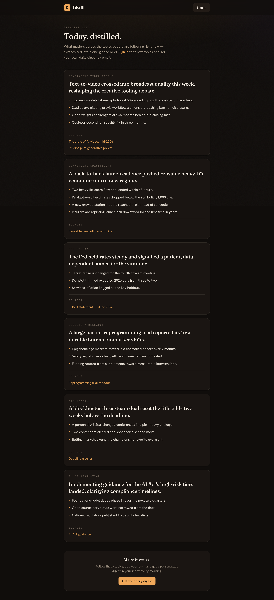

# Distill

**Distill turns the topics you care about into a daily, AI-synthesized digest.**
Land on a public **Trending** front page — full Topic Cards (one-sentence TL;DR,
4–5 bullets, sources) for what matters right now — then sign in to **follow**
topics, add your own, and get a personalized Digest emailed daily.

Originally an iOS app, Distill is now a **web app** (Next.js) backed by a Python
synthesis service. See [`docs/adr/0003`](docs/adr/0003-web-client-and-email-delivery.md)
(web pivot) and [`docs/adr/0004`](docs/adr/0004-trending-front-page.md) (trending
front page).

---

## Screenshots

| Trending front page (logged-out) | Your Digest + Trending (signed-in) |
| --- | --- |
|  |  |

| Topics & Settings | Onboarding | Sign in |
| --- | --- | --- |
|  |  |  |

---

## Running locally

### Prerequisites

- **Node.js 18.18+** (Node 22 recommended) and npm — for the web app
- **Python 3.11+** — only needed for the real backend (skip for demo mode)

### Option A — Demo mode (recommended, zero config)

The web app ships with a **demo mode** — seeded sample data and no auth — so you
can run the whole thing with no backend, database, or API keys.

```bash
cd web
npm install
npm run dev
```

Open <http://localhost:3000>. That's it — you're looking at a working Digest,
with Topics, onboarding, and per-card refresh all functional against in-memory
sample data.

> Demo mode is the default whenever no Supabase project is configured
> (`NEXT_PUBLIC_SUPABASE_URL` unset), so a fresh deploy works out of the box too.
> To force it explicitly, set `NEXT_PUBLIC_DEMO_MODE=true` in `web/.env.local`.

### Option B — Full stack (real auth, synthesis, and email)

Run the backend and web app together against Supabase. Two terminals:

```bash
# Terminal 1 — backend API + scheduler on :8000
cd backend
python3 -m pip install -e ".[dev]"
cp ../.env.example ../.env        # fill in the values (see Environment variables)
python3 -m distill.main

# Terminal 2 — web app on :3000, pointed at the local backend
cd web
cp .env.example .env.local        # set NEXT_PUBLIC_DEMO_MODE=false + Supabase vars + DISTILL_API_URL=http://localhost:8000
npm install
npm run dev
```

Then apply the database migrations and enable magic-link auth — see
[Full local setup](#full-local-setup-with-real-backend) below for the Supabase
steps and the complete environment-variable reference.

### Run the tests

```bash
cd backend && python3 -m pytest -q     # backend unit tests
cd web && npm run build && npm run lint # web typecheck + build + lint
```

---

## Architecture

```
            ┌──────────────────────────── Browser ────────────────────────────┐
            │  /  (logged out)        /  (signed in)            /topics         │
            │  Trending front page    Your Digest +             manage topics   │
            │  — full cards, no auth   Trending to follow        + settings      │
            └────────────────────────────────┬────────────────────────────────┘
                                             │  httpOnly cookie session
                                             ▼
   ┌──────────────────────── Next.js · Vercel  (web/) ────────────────────────┐
   │  Server components + server-side BFF · @supabase/ssr · magic-link auth     │
   └─────────────┬───────────────────────────────────────────────┬────────────┘
   Supabase JWT  │  (Bearer, server → server)                     │  magic link
                 ▼                                                ▼
   ┌─────────────────── FastAPI · Railway  (backend/) ───────┐   ┌───────────────┐
   │  APILayer:  GET /trending (public) · /topics · /digest  │   │  Supabase     │
   │  DigestOrchestrator → SynthesisEngine  (per Topic Card) │◀─▶│  Postgres     │
   │  SchedulerWorker (every 60s):                           │   │  + Auth       │
   │    • per-User Digest at Delivery Time → email           │   └───────────────┘
   │    • daily shared Trending digest (global, all users)   │
   └─────────────┬──────────────────┬───────────────────┬────┘
                 ▼                  ▼                   ▼
          ┌────────────┐   ┌──────────────────┐   ┌──────────────┐
          │  Exa.ai    │   │  Claude Sonnet   │   │  Resend      │
          │  (sources) │   │  (synthesis)     │   │  (email)     │
          └────────────┘   └──────────────────┘   └──────────────┘
```

- **`web/`** — Next.js 16 (App Router, TypeScript, Tailwind). UI + a thin
  server-side BFF that forwards the user's Supabase access token to the backend.
  Sessions live in httpOnly cookies (`@supabase/ssr`).
- **`backend/`** — Python/FastAPI. The synthesis pipeline plus the
  `SchedulerWorker`, which both **emails** each User's Digest at their Delivery
  Time and regenerates the **shared Trending digest** once daily. Runs as a
  long-lived Railway worker.
- **`supabase/`** — Postgres schema + migrations. Auth via magic link.
- **`ios/`** — the original SwiftUI client. **Deprecated** (see its README); kept
  for reference.

Backend modules: `SynthesisEngine` (Topic + sources → Topic Card),
`DigestOrchestrator` (`generate_cards` over any Topic list — fan-out +
partial-failure handling, reused for both per-User and Trending digests),
`SchedulerWorker` (per-User digests + the daily global Trending pass),
`EmailDigestService` (renders + sends via Resend), `APILayer` (REST consumed by
the web BFF; `GET /trending` is public). See [`docs/PRD.md`](docs/PRD.md) and the
ADRs in [`docs/adr/`](docs/adr/).

---

## Full local setup (with real backend)

Run this when you want real auth, synthesis, and email instead of demo data.

### 1. Backend

```bash
cd backend
python3 -m pip install -e ".[dev]"
cp ../.env.example ../.env   # fill in the values below
python3 -m distill.main      # starts API on :8000 + scheduler loop
```

Run the tests:

```bash
cd backend && python3 -m pytest -q
```

### 2. Supabase

Create a Supabase project, then apply the migrations in `supabase/migrations/`
(via the Supabase CLI `supabase db push`, or by pasting them into the SQL
editor in order). Enable **Email** auth (magic link) under
Authentication → Providers.

### 3. Web (against the real backend)

```bash
cd web
cp .env.example .env.local   # set NEXT_PUBLIC_DEMO_MODE=false + Supabase vars
npm install
npm run dev
```

### Environment variables

**Backend** (`.env`):

| Variable | Purpose |
| --- | --- |
| `SUPABASE_URL`, `SUPABASE_SERVICE_ROLE_KEY`, `SUPABASE_ANON_KEY` | Supabase access |
| `SUPABASE_JWT_SECRET` | Local JWT validation |
| `ANTHROPIC_API_KEY` | Claude synthesis |
| `EXA_API_KEY` | Source fetching |
| `RESEND_API_KEY`, `RESEND_FROM_EMAIL` | Daily digest email |
| `APP_BASE_URL` | Link the email points back to |
| `TRENDING_REFRESH_UTC` | Daily time to regenerate the global Trending digest (default `05:00`) |

**Web** (`.env.local`):

| Variable | Purpose |
| --- | --- |
| `NEXT_PUBLIC_DEMO_MODE` | `true` for seeded demo, `false` for real backend |
| `NEXT_PUBLIC_SUPABASE_URL`, `NEXT_PUBLIC_SUPABASE_ANON_KEY` | Auth |
| `DISTILL_API_URL` | FastAPI base URL (e.g. `http://localhost:8000`) |

---

## Deploying to the cloud

**Recommended: Vercel (web) + Railway (backend) + Supabase (db/auth).**

### Web → Vercel
1. Import the repo into Vercel and set the **root directory** to `web/`.
2. For a public demo, set no env vars (demo mode is automatic). For production,
   set `NEXT_PUBLIC_DEMO_MODE=false`, `NEXT_PUBLIC_SUPABASE_URL`,
   `NEXT_PUBLIC_SUPABASE_ANON_KEY`, and `DISTILL_API_URL`.
3. Deploy. Vercel auto-detects Next.js.

### Backend → Railway
1. New Railway service from the repo, root `backend/`.
2. Start command: `python -m distill.main` (a `Procfile`/`railway.json` may
   already be present).
3. Set the backend env vars above. The worker serves the API **and** runs the
   daily scheduler in one process.

### Database/Auth → Supabase
Apply `supabase/migrations/`, enable magic-link email, and add your Vercel URL
to Authentication → URL Configuration (redirect allowlist:
`https://your-app.vercel.app/auth/callback`).

> **Why this split?** Synthesis fans out multiple Claude calls per user and can
> exceed serverless limits, so the backend is a long-lived worker (Railway), not
> a serverless function — see `docs/adr/0001`. The web tier is stateless and fits
> Vercel perfectly.

---

## Regenerating screenshots

```bash
cd web
NEXT_PUBLIC_DEMO_MODE=true PORT=3100 npm run start &   # after `npm run build`
BASE=http://localhost:3100 node scripts/screenshots.mjs
```

---

## Project docs

- [`CONTEXT.md`](CONTEXT.md) — domain glossary (use these terms in code & issues)
- [`docs/PRD.md`](docs/PRD.md) — full product requirements
- [`docs/adr/`](docs/adr/) — architectural decisions
- [`docs/superpowers/specs/`](docs/superpowers/specs/) — the web-conversion design spec
- [`docs/superpowers/plans/`](docs/superpowers/plans/) — implementation plans
