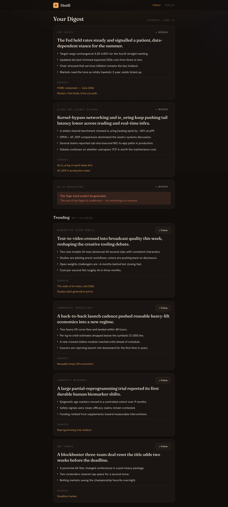
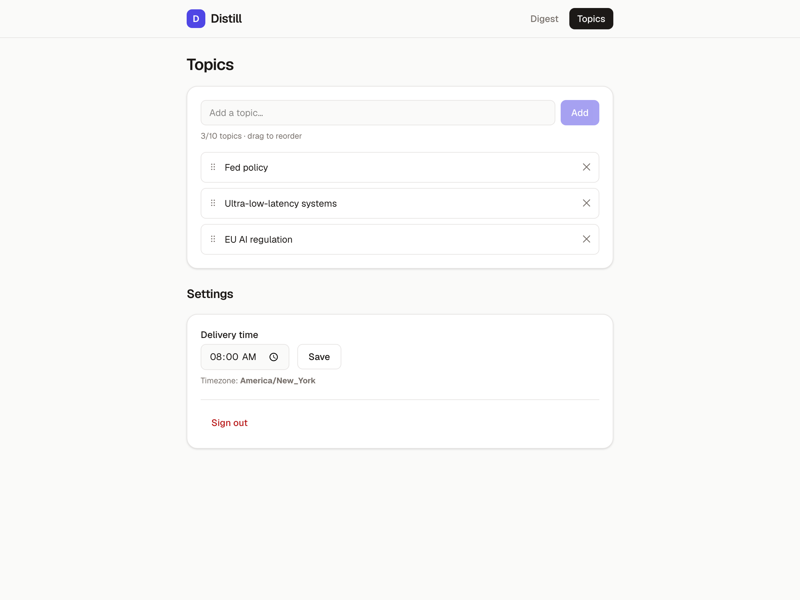
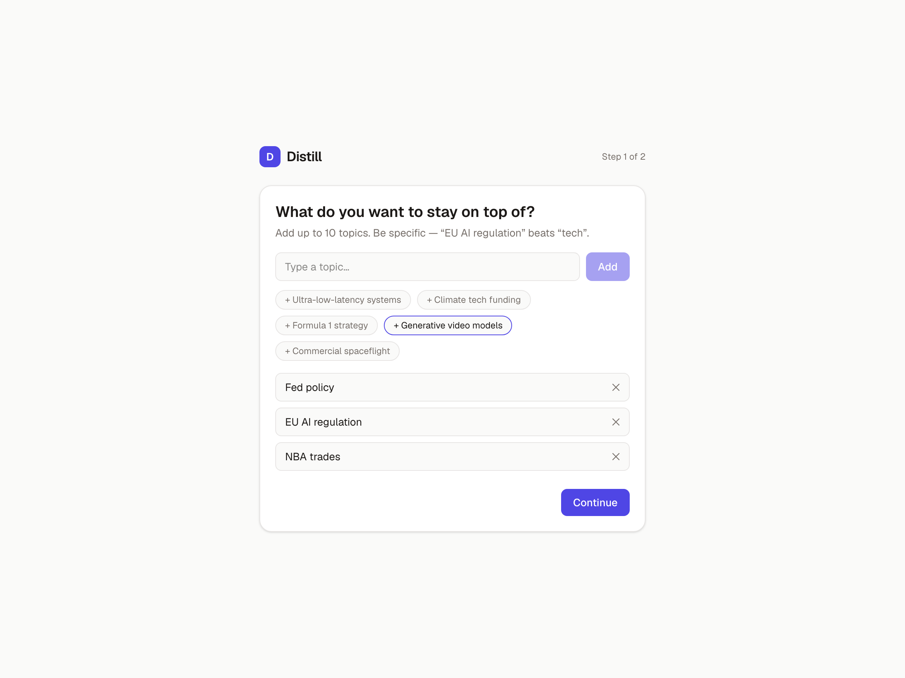
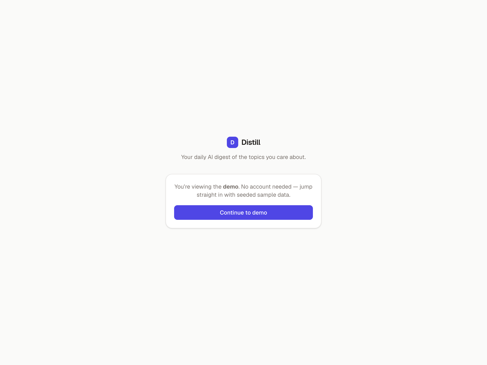

# Distill

**Distill turns the topics you care about into a daily, AI-synthesized digest.**
Define free-text Topics (e.g. _"Fed policy"_, _"ultra-low-latency systems"_) and
receive a Digest of Topic Cards — each a one-sentence TL;DR, 4–5 bullet
takeaways, and source links — emailed to you daily and refreshable on demand.

Originally an iOS app, Distill is now a **web app** (Next.js) backed by a Python
synthesis service. See [`docs/adr/0003`](docs/adr/0003-web-client-and-email-delivery.md)
for why.

---

## Screenshots

| Daily Digest | Topics & Settings |
| --- | --- |
|  |  |

| Onboarding | Sign in |
| --- | --- |
|  |  |

---

## Quick start (zero config)

The web app ships with a **demo mode** — seeded sample data and no auth — so you
can run the whole thing with no backend, database, or API keys.

```bash
cd web
npm install
npm run dev
```

Open <http://localhost:3000>. That's it — you're looking at a working Digest.

> Demo mode is the default whenever no Supabase project is configured
> (`NEXT_PUBLIC_SUPABASE_URL` unset), so a fresh deploy works out of the box too.

---

## Architecture

```
┌────────────────┐      Supabase JWT (cookie)      ┌──────────────────────┐
│  Next.js (web) │ ──────────────────────────────▶ │  FastAPI (backend)   │
│  Vercel        │   server-side BFF proxy          │  Railway worker      │
└────────────────┘                                  └─────────┬────────────┘
        │  magic-link auth                                    │
        ▼                                                     ▼
┌────────────────┐                              ┌──────────────────────────┐
│  Supabase      │  Postgres + Auth             │ Exa.ai (sources)         │
│                │                              │ Claude Sonnet (synthesis)│
└────────────────┘                              │ Resend (daily email)     │
                                                └──────────────────────────┘
```

- **`web/`** — Next.js 16 (App Router, TypeScript, Tailwind). UI + a thin
  server-side BFF that forwards the user's Supabase access token to the backend.
  Sessions live in httpOnly cookies (`@supabase/ssr`).
- **`backend/`** — Python/FastAPI. The synthesis pipeline plus the
  `SchedulerWorker` that generates and **emails** each Digest at the user's
  Delivery Time. Runs as a long-lived Railway worker.
- **`supabase/`** — Postgres schema + migrations. Auth via magic link.
- **`ios/`** — the original SwiftUI client. **Deprecated** (see its README); kept
  for reference.

Backend modules: `SynthesisEngine` (Topic + sources → Topic Card),
`DigestOrchestrator` (fan-out + partial-failure handling), `SchedulerWorker`
(polls for due users), `EmailDigestService` (renders + sends via Resend),
`APILayer` (REST consumed by the web BFF). See [`docs/PRD.md`](docs/PRD.md).

---

## Full local setup (with real backend)

Run this when you want real auth, synthesis, and email instead of demo data.

### 1. Backend

```bash
cd backend
python3 -m pip install -e ".[dev]"
cp ../.env.example ../.env   # fill in the values below
python3 -m distill.main      # starts API on :8000 + scheduler loop
```

Run the tests:

```bash
cd backend && python3 -m pytest -q
```

### 2. Supabase

Create a Supabase project, then apply the migrations in `supabase/migrations/`
(via the Supabase CLI `supabase db push`, or by pasting them into the SQL
editor in order). Enable **Email** auth (magic link) under
Authentication → Providers.

### 3. Web (against the real backend)

```bash
cd web
cp .env.example .env.local   # set NEXT_PUBLIC_DEMO_MODE=false + Supabase vars
npm install
npm run dev
```

### Environment variables

**Backend** (`.env`):

| Variable | Purpose |
| --- | --- |
| `SUPABASE_URL`, `SUPABASE_SERVICE_ROLE_KEY`, `SUPABASE_ANON_KEY` | Supabase access |
| `SUPABASE_JWT_SECRET` | Local JWT validation |
| `ANTHROPIC_API_KEY` | Claude synthesis |
| `EXA_API_KEY` | Source fetching |
| `RESEND_API_KEY`, `RESEND_FROM_EMAIL` | Daily digest email |
| `APP_BASE_URL` | Link the email points back to |

**Web** (`.env.local`):

| Variable | Purpose |
| --- | --- |
| `NEXT_PUBLIC_DEMO_MODE` | `true` for seeded demo, `false` for real backend |
| `NEXT_PUBLIC_SUPABASE_URL`, `NEXT_PUBLIC_SUPABASE_ANON_KEY` | Auth |
| `DISTILL_API_URL` | FastAPI base URL (e.g. `http://localhost:8000`) |

---

## Deploying to the cloud

**Recommended: Vercel (web) + Railway (backend) + Supabase (db/auth).**

### Web → Vercel
1. Import the repo into Vercel and set the **root directory** to `web/`.
2. For a public demo, set no env vars (demo mode is automatic). For production,
   set `NEXT_PUBLIC_DEMO_MODE=false`, `NEXT_PUBLIC_SUPABASE_URL`,
   `NEXT_PUBLIC_SUPABASE_ANON_KEY`, and `DISTILL_API_URL`.
3. Deploy. Vercel auto-detects Next.js.

### Backend → Railway
1. New Railway service from the repo, root `backend/`.
2. Start command: `python -m distill.main` (a `Procfile`/`railway.json` may
   already be present).
3. Set the backend env vars above. The worker serves the API **and** runs the
   daily scheduler in one process.

### Database/Auth → Supabase
Apply `supabase/migrations/`, enable magic-link email, and add your Vercel URL
to Authentication → URL Configuration (redirect allowlist:
`https://your-app.vercel.app/auth/callback`).

> **Why this split?** Synthesis fans out multiple Claude calls per user and can
> exceed serverless limits, so the backend is a long-lived worker (Railway), not
> a serverless function — see `docs/adr/0001`. The web tier is stateless and fits
> Vercel perfectly.

---

## Regenerating screenshots

```bash
cd web
NEXT_PUBLIC_DEMO_MODE=true PORT=3100 npm run start &   # after `npm run build`
BASE=http://localhost:3100 node scripts/screenshots.mjs
```

---

## Project docs

- [`CONTEXT.md`](CONTEXT.md) — domain glossary (use these terms in code & issues)
- [`docs/PRD.md`](docs/PRD.md) — full product requirements
- [`docs/adr/`](docs/adr/) — architectural decisions
- [`docs/superpowers/specs/`](docs/superpowers/specs/) — the web-conversion design spec
- [`docs/superpowers/plans/`](docs/superpowers/plans/) — implementation plans
